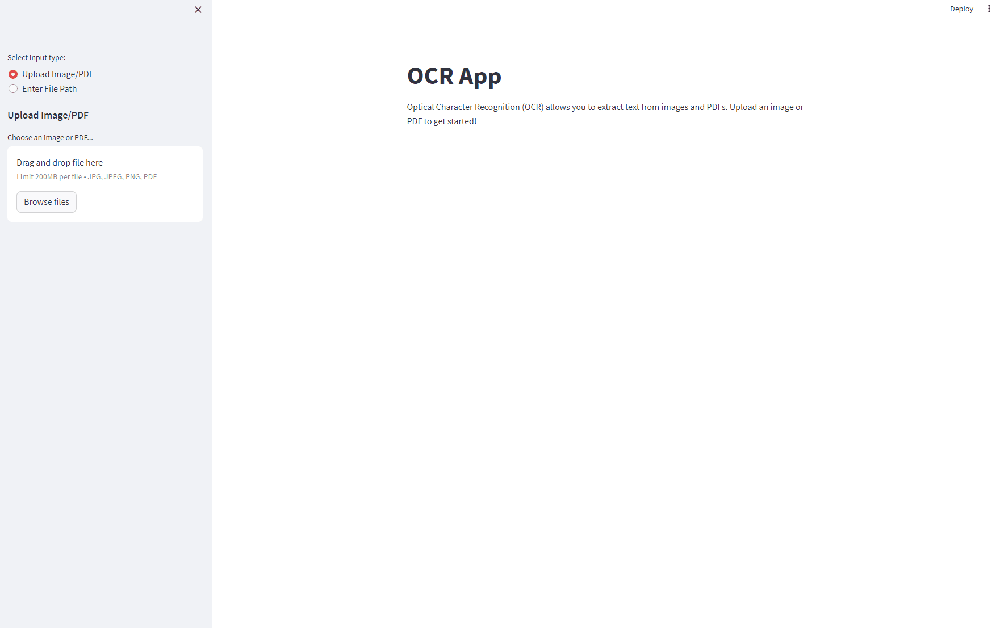

# OCR App: Optical Character Recognition Tool

Welcome to OCR App, a tool for effortlessly extracting text from images and PDF documents! With OCR App, you can quickly and accurately convert scanned text into editable and shareable content.

---

## Table of Contents

- [About OCR App](#about-ocr-app)
- [Getting Started](#getting-started)
  - [Installation](#installation)
  - [Usage](#usage)
- [Features](#features)
- [Customization](#customization)
- [Contributing](#contributing)
- [Credits](#credits)
- [License](#license)

---

## About OCR App

OCR App is a user-friendly OCR (Optical Character Recognition) application built on the Streamlit platform. It empowers you to effortlessly extract text from a variety of sources, including images and PDF documents. 

**Key highlights:**

- **Simplicity**: A clean and intuitive user interface makes OCR conversion
- **Accuracy**: Leverage state-of-the-art OCR models for highly accurate text extraction.
- **Flexibility**: Extract text from both images and multi-page PDFs.
- **Customization**: Tailor the OCR model and configurations to suit your specific needs.

Discover the magic of OCR Wonder and unlock the potential of your documents!

---

## Demo




## Getting Started

### Installation

OCR App is easy to set up. Just follow these steps:

1. **Clone the repository**:

   ```bash
   git clone https://github.com/yourusername/ocr-wonder.git
   cd ocr-wonder

2. **Create a virtual environment (optional but recommended):**
   ```shell
   python -m venv venv 
   source venv/bin/activate  # On Windows, use: venv\Scripts\activate

3. **Install the required dependencies:**
   ```shell
   pip install -r requirements.txt 

Usage
Run the Streamlit app:

shell
Copy code
streamlit run main.py
Open your web browser and navigate to the app URL (usually http://localhost:8501).

Choose the input type:

"Upload Image/PDF": Upload an image or PDF file.
"Enter File Path": Manually enter the file path.
Upload a file or enter a file path.

The app will display the input image/PDF and the extracted text.

Customization
OCR Model: Swap out the OCR model to better suit your document type.
UI Enhancements: Customize the Streamlit app's appearance and user experience.
Additional Features: Extend OCR Wonder to cater to specific use cases.
